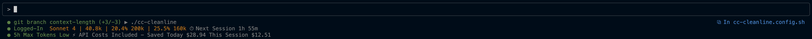

```
   ____ ____    ____ _                 _     _            
  / ___/ ___|  / ___| | ___  __ _ _ __ | |   (_)_ __   ___ 
 | |  | |     | |   | |/ _ \/ _` | '_ \| |   | | '_ \ / _ \
 | |__| |___  | |___| |  __/ (_| | | | | |___| | | | |  __/
  \____\____|  \____|_|\___|\__,_|_| |_|_____|_|_| |_|\___|
```

# CC CleanLine - Clean Claude Code Status Line

A clean, minimalist status line script for Claude Code that embodies the clean code philosophy - clear, readable, purposeful. Designed for developers who value distraction-free, professional status information.

## Philosophy

CC CleanLine follows the clean code philosophy: **every element serves a purpose, nothing is superfluous**. No decorative clutter, no visual noise - just the essential information you need, presented clearly and professionally.

This isn't just about looking good (though it does) - it's about cognitive clarity. When your status line is clean and purposeful, your mind stays focused on what matters: your code.

## Screenshot



## Features

🧹 **Clean & Minimalist** - Zero visual clutter, maximum information clarity  
⚙️ **Configurable** - Fully customizable via `statusline.config.sh`  
🔮 **Future-Proof** - Designed for extensibility and layout variations  
🧠 **Intelligent** - Smart context monitoring and real-time cost tracking  
🎯 **Focused** - 3-line output: Git + Directory / Login + Model + Time / Context + Cost  
🌈 **Color-Coded** - Model-specific colors (Sonnet=saddlebrown, Opus=sandybrown)  
📊 **Cost Tracking** - Real-time session costs via ccusage integration  
🔄 **Git Integration** - Branch detection with clean status indicators  
⚡ **Context Monitoring** - Built-in `exceeds_200k_tokens` flag support  

## Installation

1. Clone this repository:

   ```bash
   git clone https://github.com/heysash/cc-cleanline.git
   cd cc-cleanline
   ```

2. Make executable:

   ```bash
   chmod +x cc-cleanline.sh
   ```

3. Configure Claude Code (see Configuration section)

## Configuration

### Claude Code Settings

**macOS**: `~/.claude/settings.json`

```json
{
  "statusLine": {
    "type": "command",
    "command": "bash /path/to/cc-cleanline/cc-cleanline.sh"
  }
}
```

### Customization

CC CleanLine uses `statusline.config.sh` for complete customization:

- **Colors**: Status states, model colors, UI elements
- **Icons**: Status indicators (●, ○, ⚠, ✓)  
- **Labels**: Login status, context messages, model names

**Example customization:**

```bash
# Clean, professional colors
COLOR_ACTIVE_STATUS='\033[38;5;34m'     # Green
COLOR_OPUS='\033[38;5;215m'             # Sandybrown  
COLOR_SONNET='\033[38;5;130m'           # Saddlebrown

# Custom labels
LABEL_LOGGED_IN="Connected"
LABEL_MODEL="Model"
```

## Output Examples

**Active development session:**

```text
● git branch main ▶ /Users/dev/projects/app
● Logged-In ☆ LLM Sonnet 4 ⏱ Session time left 2h 43m  
✓ Context window ok ⚡ API $0 (normally $2.50)
```

**Outside git repo:**

```text
○ no git repository ▶ /tmp/scratch
○ Logged-Out ★ LLM Opus 4.1 ⏱ Session time left 1h 15m
⚠ Context window exceeded! Do /compress ⚡ API $3.80 (current session)
```

### Clean Color Scheme

- **Green** (active states): git branch, logged in, context OK
- **Red** (attention states): no git, logged out, context exceeded  
- **Sandybrown**: ★ Opus 4.1 model
- **Saddlebrown**: ☆ Sonnet 4 model
- **DarkSlateGray**: Directory paths, times, costs

## Requirements

### Required

- Bash shell
- `jq` for JSON parsing  
- Claude Code CLI

### Optional

- `git` for branch detection
- `bunx`/`npx` for ccusage cost tracking

## Technical Details

- **Context Monitoring**: Uses Claude Code's `exceeds_200k_tokens` flag
- **Cost Tracking**: Integrates with [ccusage](https://github.com/ryoppippi/ccusage) for real-time session costs
- **Git Integration**: Automatic branch detection and status
- **Configuration**: Hot-reloadable via `statusline.config.sh`
- **Output Format**: Consistent 3-line layout for reliable parsing

## Author

Created by [Sascha Rahn](https://github.com/heysash) • [heysash.com](https://heysash.com)

## License

MIT License